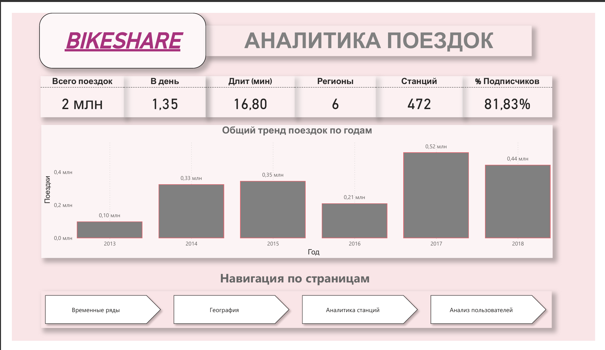
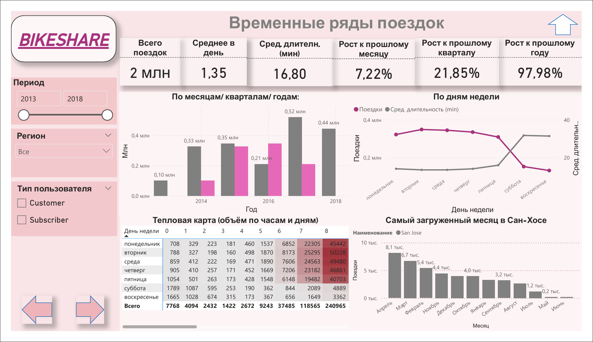
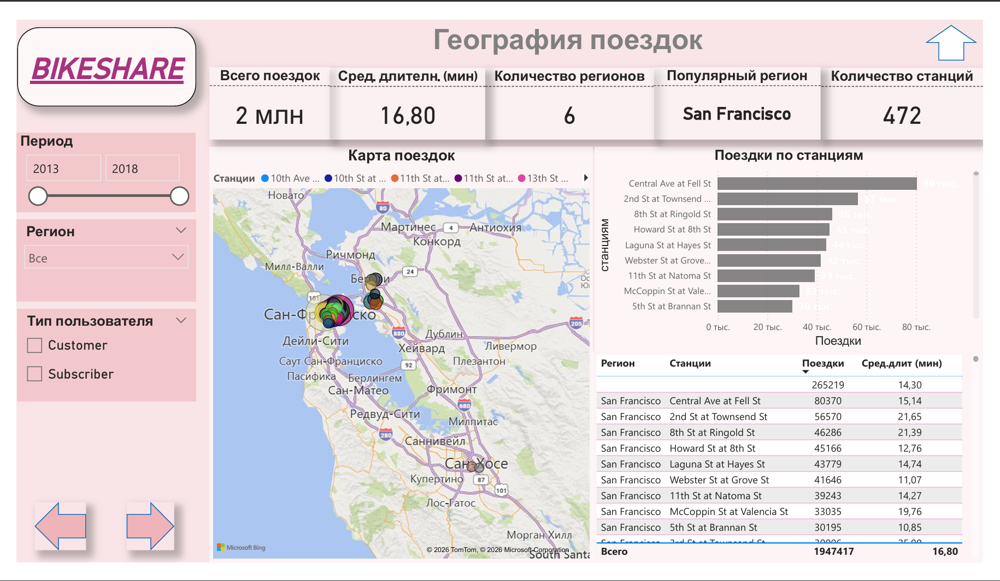
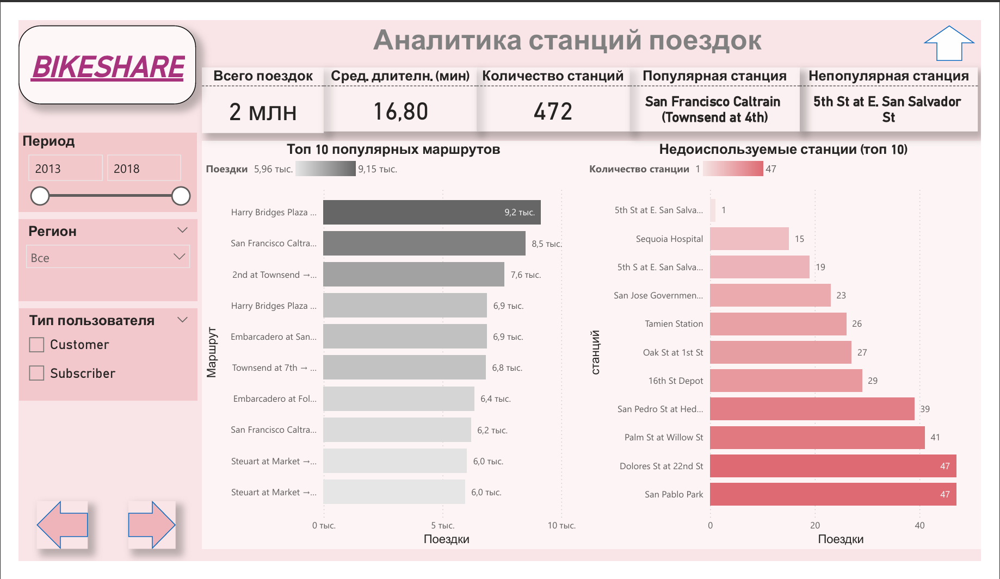
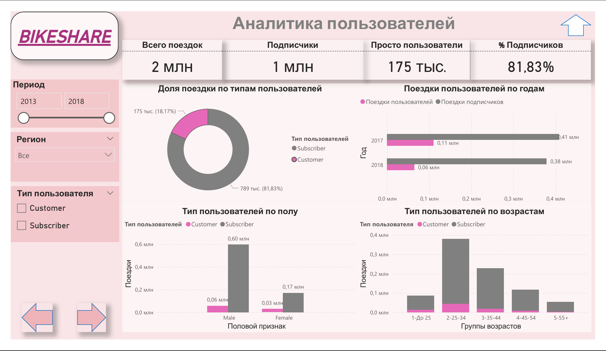

# Bikeshare_Analysis_Report
# Проект: Аналитика сервиса велошеринга (Bikeshare)

Интерактивный дашборд в Power BI для анализа данных о поездках, географии станций и пользовательской базе сервиса проката велосипедов.

## 📊 Основные отчеты и скриншоты

Проект реализован с удобной навигацией и чистым дизайном в едином стиле.

### 1. Главная страница (Навигация)
Центральный хаб с ключевыми KPI проекта и кнопками для перехода к детальным отчетам.
* **KPI:** Всего поездок (2 млн), Длительность (16,8 мин), Количество станций (472) и доля Подписчиков (81,8%).
* **Тренд:** Гистограмма общего тренда поездок по годам (2013-2018).

---

### 2. Временные ряды поездок
Детальный анализ динамики использования сервиса во времени.
* **Рост:** Анализ роста к прошлому месяцу, кварталу и году.
* **Нагрузка:** Тепловая карта объема поездок по часам и дням недели (самые загруженные — утренние и вечерние часы в будни).
* **Пики:** Анализ самых загруженных месяцев (март) и дней недели (вторник).

---

### 3. География поездок
Визуализация пространственных данных и популярных локаций.
* **Карта:** Интерактивная карта поездок с разбивкой по станциям.
* **Рейтинг:** Сводная таблица с количеством поездок и средней длительностью по конкретным станциям.

---

### 4. Аналитика станций
Глубокий разбор эффективности работы парка станций.
* **Популярность:** Рейтинг Топ-10 маршрутов.
* **Оптимизация:** Анализ "Недоиспользуемых станций" (Топ-10 аутсайдеров по количеству станций).

---

### 5. Анализ пользователей
Портрет аудитории и структура пользовательской базы.
* **Сегментация:** Доля поездок по типам пользователей (Подписчики vs Разовые клиенты — 81,8% vs 18,2%).
* **Демография:** Половой признак (Male/Female) и Группы возрастов (самая активная группа — 2-25-34 года).

---

## 🛠️ Технические навыки, продемонстрированные в проекте

* **Дизайн:** Создание единого визуального стиля и удобной интерактивной навигации между страницами.
* **Моделирование:** Построение модели данных с использованием связей между таблицами.
* **Фильтрация:** Использование синхронизированных срезов по Периоду (2013-2018), Региону и Типу пользователя.
* **Рассчитанные меры (DAX):**
    * Агрегации (`SUM`) и процентные показатели (`DIVIDE`).
    * Сложные KPI (Среднее в день, Прибыль на заказ) с использованием `CALCULATE` и `SUMX`.
    * Анализ прироста (`% growth`) к прошлым периодам.

## Как посмотреть отчет: 
1.  По запросу предоставим файл `.pbix`.
2.  Откройте его в приложении **Power BI Desktop**.
